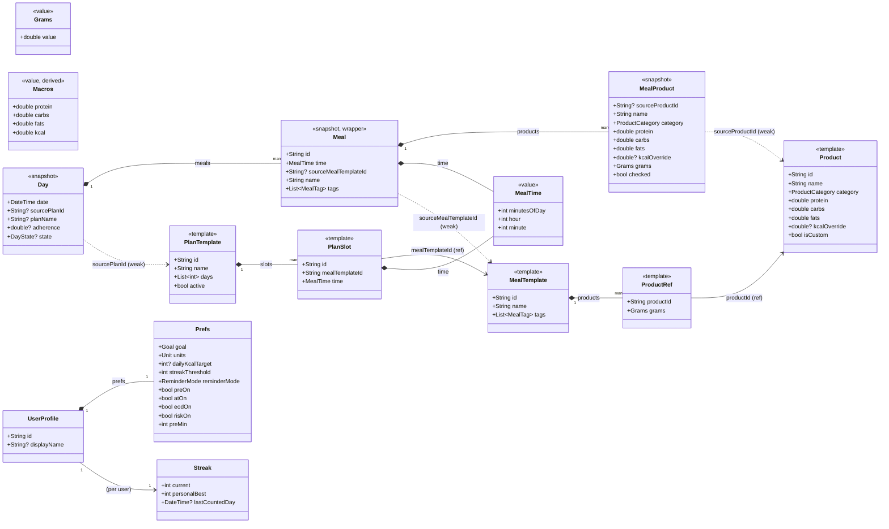
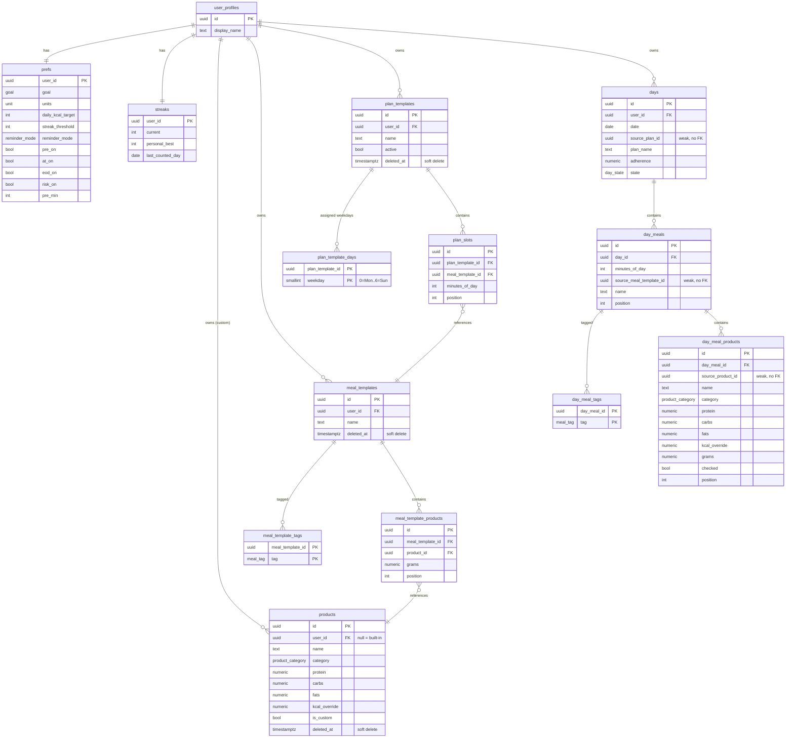
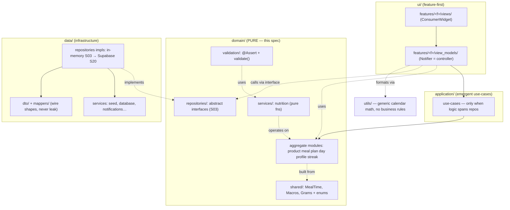

# Crudo Domain — Diagrams (S02 design companion)

Visual companion to `docs/specs/2026-06-03-s02-domain-models-nutrition.md`. Updated 2026-06-03 after the architecture brainstorm (serialization-free domain, normalized DDL, soft-delete, junction tables).

> Diagrams are **mermaid source** — render in IDEA (Markdown preview with mermaid enabled, or the Mermaid plugin). No exported images.

> **Forward-looking note.** The Postgres DDL + ERD are the *target* backend shape used to pressure-test the domain. **S02 ships Dart models only**; real schema + RLS land in **S19**. Library tree = fully normalized; **instance/snapshot tree deliberately denormalizes** (point-in-time facts, like invoice lines freezing a price — normalizing them back to FKs would break the immutability rule §8).

---

## 1. Dart domain — class diagram



**Reading it:** solid diamond = owns/embeds; plain arrow = id reference (template tree only); dotted = **weak back-ref** (nullable, no integrity dependency). The **entire domain is serialization-free** — no `fromJson`/`toJson`; DTOs live in `data/` (S20). `MealStatus` is derived (S05), never stored. Validation: `@Assert` invariants on types + `validate() → List<ValidationIssue>` extensions.

---

## 2. Target Postgres — ER diagram (S19, normalized)



---

## 3. Target DDL (S19, illustrative)

Conventions: **app-generated UUID v7** PKs (client-creatable for offline-first, time-ordered for B-tree locality) · `numeric` for exact nutrition decimals · `created_at`/`updated_at timestamptz` on every table (`updated_at` via trigger — omitted below for brevity) · RLS per `user_id` on every user-owned table (S19) · index every FK.

```sql
-- ENUM types (fixed domain sets)
create type meal_tag         as enum ('breakfast','lunch','dinner','snack','pre_workout','post_workout');
create type product_category as enum ('meat','fish','eggs','grain','veg','fruit','oil','custom');
create type goal             as enum ('cut','maintain','bulk');
create type unit             as enum ('g','oz');
create type reminder_mode    as enum ('fixed','interval');
create type day_state        as enum ('green','yellow','red');
-- meal_status is DERIVED — no column anywhere.

-- ---------- profile (prefs = separate 1:1 table) ----------
create table user_profiles (
  id           uuid primary key,                    -- = auth.uid() at S22
  display_name text,
  created_at   timestamptz not null default now(),
  updated_at   timestamptz not null default now()
);

create table prefs (
  user_id           uuid primary key references user_profiles(id) on delete cascade,
  goal              goal          not null default 'maintain',
  units             unit          not null default 'g',
  daily_kcal_target int           check (daily_kcal_target is null or daily_kcal_target > 0),
  streak_threshold  int           not null default 80 check (streak_threshold in (70,80,90,100)),
  reminder_mode     reminder_mode not null default 'fixed',
  pre_on  bool not null default true,
  at_on   bool not null default true,
  eod_on  bool not null default true,
  risk_on bool not null default true,
  pre_min int  not null default 30 check (pre_min between 0 and 240),
  created_at timestamptz not null default now(),
  updated_at timestamptz not null default now()
);

create table streaks (
  user_id          uuid primary key references user_profiles(id) on delete cascade,
  current          int  not null default 0 check (current >= 0),
  personal_best    int  not null default 0 check (personal_best >= 0),
  last_counted_day date,
  created_at timestamptz not null default now(),
  updated_at timestamptz not null default now(),
  check (personal_best >= current)
);

-- ---------- template tree (normalized; soft-delete on library items) ----------
create table products (
  id            uuid primary key,
  user_id       uuid references user_profiles(id) on delete cascade,  -- null = global built-in seed
  name          text not null check (length(btrim(name)) > 0),
  category      product_category not null,
  protein       numeric(6,2) not null check (protein >= 0),           -- per 100 g
  carbs         numeric(6,2) not null check (carbs   >= 0),
  fats          numeric(6,2) not null check (fats    >= 0),
  kcal_override numeric(7,2) check (kcal_override is null or kcal_override >= 0),
  is_custom     bool not null default false,
  deleted_at    timestamptz,                                          -- soft delete
  created_at    timestamptz not null default now(),
  updated_at    timestamptz not null default now(),
  check (protein + carbs + fats <= 101)   -- per-100g mass, ±1 g tolerance
  -- ±10% kcal_override rule is app/edge-validated (needs the calculated value).
);
create index on products (user_id) where deleted_at is null;

create table meal_templates (
  id         uuid primary key,
  user_id    uuid not null references user_profiles(id) on delete cascade,
  name       text not null check (length(btrim(name)) > 0),
  deleted_at timestamptz,
  created_at timestamptz not null default now(),
  updated_at timestamptz not null default now()
);
create index on meal_templates (user_id) where deleted_at is null;

create table meal_template_tags (                       -- 1NF: tag junction
  meal_template_id uuid not null references meal_templates(id) on delete cascade,
  tag              meal_tag not null,
  primary key (meal_template_id, tag)
);

create table meal_template_products (                   -- ProductRef
  id               uuid primary key,
  meal_template_id uuid not null references meal_templates(id) on delete cascade,
  product_id       uuid not null references products(id),
  grams            numeric(7,2) not null check (grams > 0),
  position         int not null default 0,
  unique (meal_template_id, position)
);
create index on meal_template_products (product_id);

create table plan_templates (
  id         uuid primary key,
  user_id    uuid not null references user_profiles(id) on delete cascade,
  name       text not null check (length(btrim(name)) > 0),
  active     bool not null default true,
  deleted_at timestamptz,
  created_at timestamptz not null default now(),
  updated_at timestamptz not null default now()
);
create index on plan_templates (user_id) where deleted_at is null;

create table plan_template_days (                       -- 1NF: weekday junction
  plan_template_id uuid not null references plan_templates(id) on delete cascade,
  weekday          smallint not null check (weekday between 0 and 6),   -- 0=Mon
  primary key (plan_template_id, weekday)
);

create table plan_slots (
  id               uuid primary key,
  plan_template_id uuid not null references plan_templates(id) on delete cascade,
  meal_template_id uuid not null references meal_templates(id),
  minutes_of_day   int not null check (minutes_of_day between 0 and 1439),
  position         int not null default 0,
  unique (plan_template_id, position)
);
create index on plan_slots (meal_template_id);

-- ---------- instance tree (DETACHED snapshots — deliberate denormalization, NO FK on source_*) ----------
create table days (
  id             uuid primary key,
  user_id        uuid not null references user_profiles(id) on delete cascade,
  date           date not null,                          -- user's local calendar date
  source_plan_id uuid,                                   -- weak back-ref, intentionally no FK
  plan_name      text,
  adherence      numeric(4,3) check (adherence is null or adherence between 0 and 1),
  state          day_state,
  created_at timestamptz not null default now(),
  updated_at timestamptz not null default now(),
  check ((adherence is null) = (state is null)),         -- frozen together at midnight-lock
  unique (user_id, date)
);

create table day_meals (                                 -- instance Meal (scheduling wrapper; id slot-stable)
  id                      uuid primary key,
  day_id                  uuid not null references days(id) on delete cascade,
  minutes_of_day          int not null check (minutes_of_day between 0 and 1439),
  source_meal_template_id uuid,                          -- weak back-ref, no FK
  name                    text not null,
  position                int not null default 0,
  created_at timestamptz not null default now(),
  updated_at timestamptz not null default now(),
  unique (day_id, position)
);

create table day_meal_tags (
  day_meal_id uuid not null references day_meals(id) on delete cascade,
  tag         meal_tag not null,
  primary key (day_meal_id, tag)
);

create table day_meal_products (                         -- MealProduct snapshot
  id                uuid primary key,
  day_meal_id       uuid not null references day_meals(id) on delete cascade,
  source_product_id uuid,                                -- weak back-ref, no FK
  name              text not null,
  category          product_category not null,
  protein           numeric(6,2) not null check (protein >= 0),
  carbs             numeric(6,2) not null check (carbs   >= 0),
  fats              numeric(6,2) not null check (fats    >= 0),
  kcal_override     numeric(7,2),
  grams             numeric(7,2) not null check (grams > 0),
  checked           bool not null default false,
  position          int not null default 0,
  created_at timestamptz not null default now(),
  updated_at timestamptz not null default now(),
  unique (day_meal_id, position)
);
```

**Why instance tables omit FKs to library tables:** a FK forces `cascade` (corrupts history) or `restrict` (blocks library cleanup). Snapshots are self-contained; `source_*_id` is a soft pointer for "open in library if it still exists". Library cleanup itself is **soft-delete** (`deleted_at`), so template→product FKs stay valid forever.

---

## 4. Architecture — layers & dependency rule ("Riverpod MVVM + shared DDD core")



```
Dependency rule:  ui → application → domain ← data        domain → NOTHING
Spring mapping:   Notifier ≈ @Service entry · Repository ≈ @Repository · data service ≈ EntityManager/WebClient
Rules live on aggregates (rich domain) — not in controllers, not in widgets, never in utils.
```
