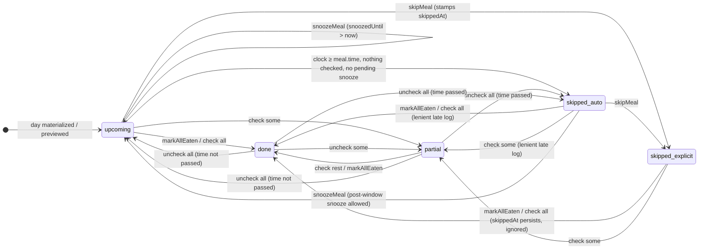
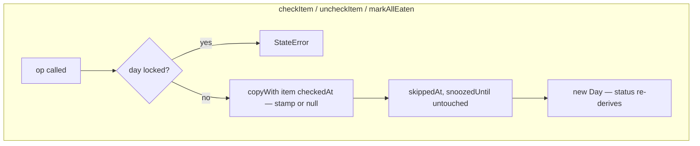
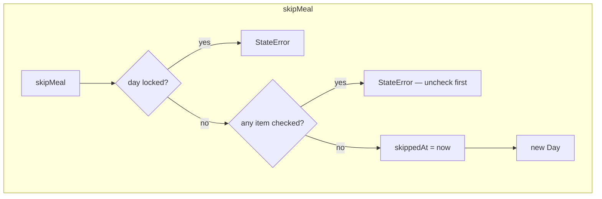
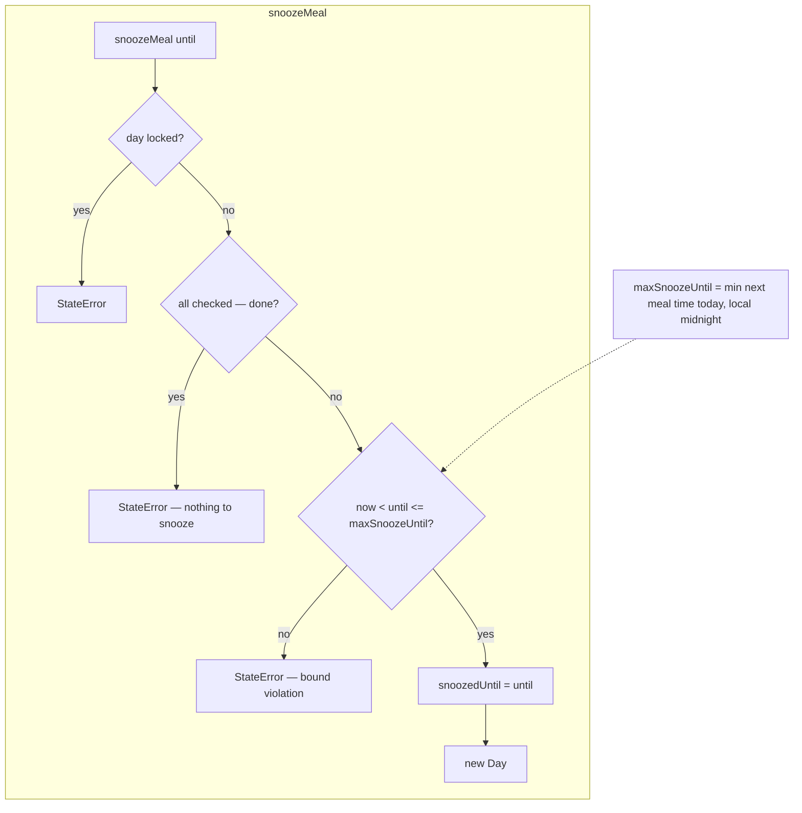
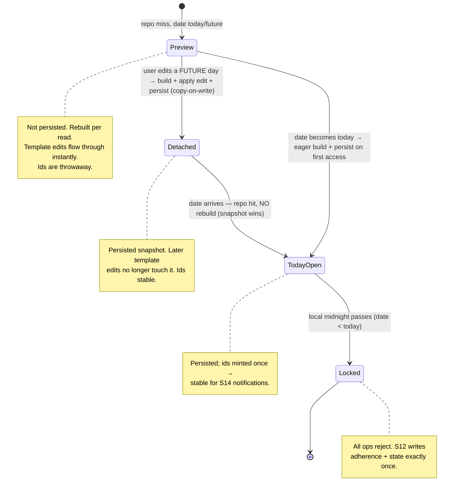
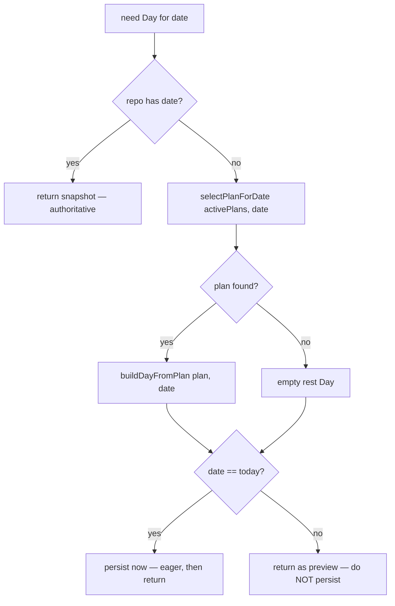
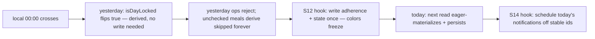

# S05 — Meal Lifecycle Engine (design, for verification)

Status: **verified design** — companion to the contract spec `docs/specs/2026-06-04-s05-meal-lifecycle.md` (where wording differs, the spec wins; this doc carries rationale, diagrams, use cases, edge ledger, decisions log).

Scope (locked during brainstorm): **pure domain logic only** — status derivation, lifecycle operations on the `Day` aggregate, snooze bounds, kcal math, day materialization functions. No repositories, no Riverpod, no widgets (S06), no notification scheduling (S14), no adherence/streak math (S12). Depends on S02 models only, plus a small S02 model refactor described below.

All diagrams are Mermaid source — render in IDEA.

---

## 1. Model

### 1.1 The refactor: split scheduling from food

S02's instance `Meal` currently flattens several concerns into one type. S05 splits the instance tree so that **each level is a thin state-wrapper around a purer value below it**: timing acts live on the scheduling wrapper, consumption marks live on the item wrapper, and the food data itself stays a pure value:

```mermaid
classDiagram
    direction LR
    class Day {
        +DateTime date  «UTC-encoded local-date label, midnight-normalized»
        +String? sourcePlanId
        +String? planName
        +List~ScheduledMeal~ meals
        +double? adherence      «null while open; frozen at lock by S12»
        +int? thresholdUsed     «threshold active that day (70/80/90/100); frozen with adherence»
        +DateTime? lockedAt     «audit stamp: when S12 froze the verdict»
    }
    class ScheduledMeal {
        +String id            «slot-stable uuid v7; notifications key off it»
        +MealTime time        «minutes from midnight, 0–1439»
        +DateTime? skippedAt  «UTC instant; explicit skip; persists forever»
        +DateTime? snoozedUntil «UTC instant; last snooze target; persists forever»
        +MealSnapshot meal    «swap = replace this field; id + time survive»
    }
    class MealSnapshot {
        +String? sourceMealTemplateId  «weak back-ref»
        +String name
        +List~MealTag~ tags
        +List~MealItem~ items
    }
    class MealItem {
        +DateTime? checkedAt  «UTC instant; null = not eaten — the consumption mark»
        +FoodSnapshot food
    }
    class FoodSnapshot {
        +String? sourceFoodId  «weak back-ref to library»
        +String name
        +FoodKind kind     «product | dish — display/filter only»
        +FoodCategory category
        +Grams grams          «the fixed portion weight, e.g. 60g»
        +double protein       «ABSOLUTE for these grams — computed at creation»
        +double carbs
        +double fat
        +double kcal
    }
    Day "1" o-- "0..*" ScheduledMeal
    ScheduledMeal "1" *-- "1" MealSnapshot
    MealSnapshot "1" *-- "1..*" MealItem
    MealItem "1" *-- "1" FoodSnapshot
```



**The pattern — a state-wrapper around a pure value at every level:** `Day` (day verdict state) → `ScheduledMeal` (timing state) → `MealSnapshot` (content record) → `MealItem` (consumption state) → `FoodSnapshot` (pure value). The mark travels with its item — no index coupling, no parallel structures, ordering is display-only.

**Symmetry with the template tree:** `PlanSlot : MealTemplate :: ScheduledMeal : MealSnapshot`, and `FoodRef { foodId, grams } ↔ MealItem { checkedAt?, food: FoodSnapshot }` — the template *references* the library food at a weight; the instance embeds the *resolved, computed* snapshot plus its consumption state. Templates never change during a day; snapshots are the day's living record, freely divergent without touching templates.

**Snapshot = food fixed at a weight.** The library `Food` stays a per-100g template (name, category, macros, kcal — all per 100 g). `FoodSnapshot` is that food at specific grams: absolute macros + kcal are **computed once at snapshot creation** (`per100g × grams / 100`) and stored; per-100g values are not carried along (derivable as `abs / grams × 100` if ever needed; grams edits scale linearly).

> **Amendment to "never store computed totals":** the rule's spirit is *no stale duplicates of a living source*. Inside a snapshot the per-100g source is deliberately dropped, so the absolutes are the canonical leaf data — nothing exists to go stale against. Meal/day totals remain derived by summation, never stored.

| Concern | Lives on | Why |
|---|---|---|
| Identity for notifications / "this meal" refs | `ScheduledMeal.id` | survives content swaps |
| Time, skip, snooze | `ScheduledMeal` | timing acts — scheduling state, not food |
| Name, tags, item list | `MealSnapshot` | the day's content record |
| Per-item consumption (`checkedAt?`) | `MealItem` | mark travels with its item — nothing to sync |
| Item weight + absolute macros/kcal | `FoodSnapshot` | pure food value, state-free |
| Status | **nowhere** | always derived (§2) |

### 1.2 Field semantics

- `MealItem.checkedAt: DateTime?` (UTC) — the consumption mark: null = not eaten, value = when eaten. "Checked" anywhere in this document means *`checkedAt != null` on that item*. The mark lives **on the item wrapper**, so it travels with its food through any list operation — no index keys, no parallel structures, nothing to desync. Un-checking sets it back to null (its when-data is lost — accepted). List order is display-only, not identity. Earlier designs (index-keyed map on `ScheduledMeal`; mark on `FoodSnapshot`) rejected: the map required cross-object index-stability contracts; mark-on-food polluted the pure food value.
  - **Content-edit guard (business rule, not a data-integrity need):** content ops (`replaceMeal`, S08's future add/remove/edit-grams) require status `upcoming` — any checked item ⇒ `partial`/`done` ⇒ rejected. This blocks the "delete what I didn't eat" adherence cheat; the model itself would survive edits fine. Add-item-to-partial ("also ate an apple") deliberately deferred — strict v1.
  - `Day.meals` order is likewise not identity-critical — meals are addressed by `id`, derivation uses `time`; list order = time order at materialization.
- `skippedAt: DateTime?` (UTC) — set by the explicit **Skip** action (notification button or in-app). **Never auto-cleared**: if the user skips at 11:00 and eats at 14:00, the stamp survives so analytics can later show "skipped then ate". Re-skip overwrites. Derivation simply ignores it once anything is checked.
- `snoozedUntil: DateTime?` (UTC) — set by **Snooze**; the last snooze target ("did the user snooze, and to when"). **Never auto-cleared**, repeatable (overwrites). S14 cancels/reschedules notifications from *derived status*, never from this field alone.
- `Day.lockedAt: DateTime?` (UTC) — **audit stamp only**: written by S12 in the same operation that freezes `adherence` + `thresholdUsed`. The lock *predicate* stays date-derived (`isDayLocked = day.date < today`) so days lock correctly even when the app was closed across midnights and no write ever happened.
- `Day.adherence` + `Day.thresholdUsed` — frozen *facts*, not verdicts: the consumed/planned ratio and the streak threshold active that day. `DayState` (green/yellow/red) is **never stored** — it derives as `dayState(adherence, thresholdUsed)` (S12). Changing the threshold in settings affects future days only; history keeps the threshold it was judged with — configurable without recoloring.
- Auto-skip (a window passing with no action) writes **nothing** — it is purely derived from the clock, which is what makes the lenient rule ("log any time that day") free: checking items later simply re-derives a different status.

### 1.3 Invariants (`@Assert` tier)

- `Day.date` is UTC-encoded, midnight-normalized (existing).
- `adherence`, `thresholdUsed`, `lockedAt` — all null or all set (frozen together; replaces the old pair invariant).
- `ScheduledMeal.id` non-empty.
- No two `ScheduledMeal`s in one `Day` share an `id`.

Note deliberately **absent**: no "skippedAt and checked items can't coexist" — they can (skip-then-eat), checked wins in derivation.

### 1.4 Food lifecycle — library, reference, copy

The library `Food` (S02/S03, `FoodRepository`: 63-food seed + user customs from S07) is the system's minimal unit — anything from "Chicken Breast" to a whole "Pasta Carbonara" entered as one item with per-100g macros of the dish. It is a **per-100g template**: name, kind, category, protein/carbs/fat and kcal, all per 100 g. `kind: FoodKind { product, dish }` is display/filter-only (library "Dishes" group, meal-row icon) — the engine never reads it; seed data ships pre-tagged (current 63 = all `product`), user-created items get a Product|Dish toggle in the S07 form (default `product`). `category` stays orthogonal (a dish may still be `custom`). Kcal is a plain stored value — defaulted to `p×4 + c×4 + f×9` at input, or user-entered and validated within **±10%** of the formula (S07 owns that flow). There is **no `kcalOverride` field** — the accepted value simply *is* the kcal. Three relationships to the food:

| Where | Relationship | Effect of a later library edit/delete |
|---|---|---|
| Library (`FoodRepository`) | the stored, mutable, deletable entity (per-100g) | — |
| Template tree (`FoodRef { foodId, grams }`) | **reference** by id, at a chosen weight | edit flows to all future previews automatically (previews re-resolve on every build) |
| Instance tree (`FoodSnapshot` in `Meal.items`) | **computed copy** — food fixed at grams, absolutes baked in | none — logged/scheduled days are frozen |

`FoodSnapshot` is created by one pure domain factory — `FoodSnapshot.from(Food food, Grams grams)`, which computes the absolute macros/kcal for those grams — at three points: (1) `buildDayFromPlan` resolving `FoodRef`s (the origin food must exist at that moment — dangling refs are dropped), (2) the S08 meal editor adding an ingredient to a day's meal, (3) first use of an S07 custom food. It is **never stored standalone**: no repo, no own id — it persists only embedded in `Meal → ScheduledMeal → Day` via `DayRepository`; `sourceFoodId` is a weak back-ref only.

> **Open obligation (S07/S09, not S05):** deleting a library food that templates still reference leaves a dangling `FoodRef`. Days are safe (they hold copies); template-side policy — block delete while referenced, or cascade-remove from templates — must be decided in S07/S09.

---

## 2. Status derivation (pure function)

`MealStatus deriveMealStatus(ScheduledMeal sm, DateTime dayDate, DateTime now)` in `lib/domain/services/meal_lifecycle.dart`. `now` is the local wall-clock time; `dayDate` is the day's label. Status is **never stored** — recomputed on every read.

### 2.1 Priority chain

```
1. any item checked          → all items checked ? done : partial  (clock and stamps irrelevant)
2. dayDate <  today          → skipped                        (history freezes unchecked meals)
3. dayDate >  today          → upcoming                       (future preview)
-- today only from here --
4. skippedAt != null         → skipped                        (explicit skip)
5. snoozedUntil > now        → upcoming                        (pending snooze; UI adds chip:
                                                               crossed planned time + gray new time)
6. now >= meal time          → skipped                        (auto-skip; window passed)
7. otherwise                 → upcoming
```

Rationale for the order:

- **Checked always wins** (rule 1): eating is the strongest fact. Allows eating early (before the window), and late logging after auto-skip or explicit skip — the lenient core rule.
- **Explicit skip beats snooze** (4 before 5): "skip" after a snooze means the user changed their mind.
- **Snooze beats the clock** (5 before 6): a snoozed meal whose original window passed shows `upcoming` until `snoozedUntil`, then falls through to auto-skipped if still untouched.

### 2.2 State machine view

Statuses are derived, so "transitions" are field mutations (operations) or passive clock movement:



`skipped_auto` and `skipped_explicit` both render as `MealStatus.skipped` — split above only to show the distinct paths. The enum keeps its four values (`done / partial / upcoming / skipped`); "snoozed" is **not** a fifth status — the UI derives the chip (crossed-out planned time, gray new time to the right) directly from `snoozedUntil`.

### 2.3 Non-today derivation

- **Past (locked) day:** rule 1, else `skipped`. A partially-checked meal stays `partial` forever; an untouched one is `skipped` forever. The clock no longer matters.
- **Future (preview) day:** rule 1, else `upcoming`. Previews are read-only, so in practice everything derives `upcoming`.

---

## 3. Operations on the `Day` aggregate

Rich-domain methods on `Day` (freezed `const Day._()` body): each returns a **new `Day`** or rejects. Pure — `now`/`today` always passed in, no clock reads in domain.

**Addressing:** `mealId` is always `ScheduledMeal.id` (the uuid — never a list position); `itemIndex` is the position in that meal's `items` list *at call time* (transient addressing — the UI renders the list and reports the tapped row; rejects out-of-range). Item identity does not depend on order (§1.2); the index is merely the call-site selector.

| Op | Mutation | Guards (beyond day-lock) |
|---|---|---|
| `checkItem(mealId, itemIndex, now, today)` | `items[i] = items[i].copyWith(checkedAt: now)` | rejects out-of-range index |
| `uncheckItem(mealId, itemIndex, now, today)` | `items[i] = items[i].copyWith(checkedAt: null)` (when-data lost) | — |
| `markAllEaten(mealId, now, today)` | stamps `checkedAt = now` on every unchecked item ("Ate it" one-tap); already-checked items keep their original stamp | — |
| `skipMeal(mealId, now, today)` | `skippedAt = now` (re-skip overwrites) | rejects if any item checked — skip of an eaten meal is meaningless; uncheck first |
| `snoozeMeal(mealId, until, now, today)` | `snoozedUntil = until` (re-snooze overwrites) | rejects if all items checked (done); rejects if `until > maxSnoozeUntil` or `until <= now` |
| `replaceMeal(mealId, MealSnapshot newMeal, now, today)` *(S08 wires UI; engine op ships now)* | swaps `ScheduledMeal.meal`; `id` + `time` survive; incoming items unchecked | rejects unless derived status == `upcoming` (any checked item ⇒ partial/done ⇒ rejected — content-edit guard, §1.2) |

**Universal first guard:** `isDayLocked(day, today)` → reject. Locked = `day.date` before today's label. Nothing on a locked day is ever mutable.

**Stamps survive marking:** check/uncheck/markAllEaten never touch `skippedAt`/`snoozedUntil` (analytics keep, §1.2).

**Failure style:** public predicates for UI pre-checks; ops `throw StateError` on a violated guard (reaching it is a programmer error — views must consult predicates first):

```dart
bool  isDayLocked(Day day, DateTime today);
bool  canEditMealContent(ScheduledMeal sm, DateTime dayDate, DateTime now);   // status == upcoming && !locked
bool  canSkipMeal(Day day, String mealId, DateTime today);                    // !locked && no item checked
bool  canSnoozeMeal(Day day, String mealId, DateTime now, DateTime today);    // !locked && !done && bound window non-empty
DateTime maxSnoozeUntil(Day day, String mealId, DateTime now);                // see §3.2
```

Every throwing op has a matching predicate — views never discover a guard by catching.

### 3.1 Op flowcharts







### 3.2 Snooze bound

`maxSnoozeUntil(day, mealId, now)` = the earlier of:

- the next meal **by `time` value strictly greater** than this meal's time (list order is display-only and never used; meals sharing the same `time` don't bound each other — they share the window), converted to a local instant on `day.date`;
- the **end-of-day midnight** — the local instant where `day.date + 1` begins (so a meal at `MealTime(0)` still has the whole day to snooze into).

Last meal of the day (by time) → bound is end-of-day midnight. Snooze is repeatable and allowed even after the window passed ("remind me later anyway" — fits leniency); each snooze is re-bounded from `now`.

---

## 4. Materialization & copy-on-write

### 4.1 Pure functions

```dart
PlanTemplate? selectPlanForDate(List<PlanTemplate> plans, DateTime date);
// active && days contains date.weekday; >1 match (defensive — S09 blocks conflicts) → lowest id.

Day buildDayFromPlan(
  PlanTemplate? plan, DateTime date, IdGenerator ids,
  List<MealTemplate> mealTemplates, List<Food> foods,
);
// PURE — no repo access; the S06 controller fetches templates + library
// foods from repos and passes them in RAW (no pre-filtering). The function
// itself resolves each FoodRef/slot by id against the passed lists; a
// missing referenced template/food (dangling ref, §1.4) → that slot/item
// is dropped defensively (S07/S09 prevent the situation upstream).
// plan == null → empty rest Day (no meals, no plan refs).
// otherwise: one ScheduledMeal per PlanSlot, sorted by time;
//   id = ids.newId() (uuid v7, S03 IdGenerator), time = slot.time,
//   meal = MealSnapshot of the slot's MealTemplate: each FoodRef resolves via
//   MealItem(checkedAt: null, food: FoodSnapshot.from(libraryFood, ref.grams))
//   — absolutes computed here.
```

Snapshot resolution keeps weak `source*Id` back-refs only; per-100g values stay in the library, absolutes land in the snapshot (§1.1).

**Confirmed consumers of the preview path (2026-06-04):** the product vision is a Google-Calendar-like week — and this model *is* the calendar model: previews = recurring-event expansion (never stored per-occurrence); detached days = exception instances; template edit = series edit (hits all non-excepted occurrences). Week view (open tomorrow, see planned), future-day meal/product swaps (→ detach), and a shopping-list summary (pure derivation over a date range of previews + detached days, grouped by `sourceFoodId` — no persistence, S13+/post-MVP) all ride this path. Materialize-ahead reconsidered and rejected again: it adds detached-flags + regeneration sync for zero benefit to these goals; the only genuine pressure (OS notifications need pre-scheduling) is S14's and solvable there (template-derived payload now, or a flagged short horizon later) without touching the engine.

### 4.2 Day lifecycle



### 4.3 Day resolution (the read path — contract for the S06 controller)



Rules this encodes:

- **Repo presence is the authoritative bit.** A persisted Day is a snapshot; it always wins over the template. No re-materialization, no sync.
- **Today persists eagerly** on first access (first app-open of the day / midnight rollover) so `ScheduledMeal.id`s are minted exactly once — S14 schedules notifications against stable ids. *(If S14 ever needs tomorrow's ids for pre-scheduling, it materializes tomorrow at scheduling time — literally "snapshot-on-schedule".)*
- **Future days persist only on first direct edit** (copy-on-write → `Detached`). Until then they are pure template output, so template edits affect all untouched future days instantly — "plan edits affect future only" holds by construction.
- **Past days** are only ever read from the repo (they were persisted when they were today). A repo miss on a past date = the app was never opened that day → render an empty locked day (derives all-skipped / no data); S12 decides how that colors the streak.

The orchestration itself (repo calls, persistence) is **S06 controller work** — S05 ships the pure functions and this contract.

### 4.4 Midnight rollover



There is **no engine timer**: locking is derived from date comparison, so it is correct even if the app was closed for a week (all intervening days lock retroactively on resume). S06 re-evaluates on app resume + a midnight tick; the S12/S14 hooks fire then.

---

## 5. Time handling

- Every function takes explicit `now` / `today` — the domain never reads a clock (testability; purity).
- `now` is the device-local wall-clock `DateTime`; `today` = `DateTime.utc(now.year, now.month, now.day)` — the S02 day-label convention.
- A meal's concrete instant = `day.date` (y/m/d) + `MealTime.minutesOfDay`, compared in local time. Midnight bound = start of the next calendar day, local.
- **Strict midnight** (locked decision): the day is the local calendar day, lock at 00:00 sharp. "A meal at 01:00 belongs to the previous day's plan" is satisfied as *assignment follows the scheduled day, never the logging instant* — and logging closes at midnight, so a 01:00 log attempt for yesterday is simply rejected. A plan slot at 01:00 is an early-morning meal of that same calendar day.
- DST: comparisons use local wall-clock; a 23:00 meal on a DST-change day still locks at that day's (shifted) midnight. No special handling in v1.
- Generic date helpers (label conversion, next-midnight) go to `utils/` (calendar math, no business rules) if not already present.

---

## 6. Kcal math (pure, composes S02 nutrition)

```
plannedKcal(day)        = Σ item.food.kcal over all ScheduledMeals, all items
consumedKcal(day)       = Σ item.food.kcal over items where checkedAt != null
                          done → all items, partial → checked subset,
                          skipped / upcoming → 0
```

No multiplication at read time — absolutes were computed once at snapshot creation (§1.1). The per-100g formula (`p×4 + c×4 + f×9`, ±10% check) lives at *input time* in the library (S07).

Consumed ≤ planned always (only planned items are markable). Adherence ratio, threshold, day coloring = **S12**, not here. Both functions live in `meal_lifecycle.dart` (or extend `nutrition.dart` — implementer's call, spec will fix one).

---

## 7. Notification interplay (S14 contract — engine guarantees)

S05 ships no scheduling. It guarantees the data + ops S14 needs:

| Notification | Fires at | Engine touchpoint |
|---|---|---|
| Pre-meal | `time − preMin` | `ScheduledMeal.time` + stable `id` (eager-persist, §4.3) |
| At-time (actions) | `time` | the three ops below |
| — **Ate it** | | `markAllEaten(mealId, now, today)` — whole meal done, one tap, no app open |
| — **Snooze** | | `maxSnoozeUntil(...)` → pick ≤ bound → `snoozeMeal(...)`; S14 reschedules to `snoozedUntil` |
| — **Skip** | | `skipMeal(mealId, now, today)` |
| Snoozed reminder | `snoozedUntil` | cancel rule: fire only if derived status is still `upcoming` — never decide from the field alone (checked wins) |
| End-of-day summary | fixed evening time | `consumedKcal` / `plannedKcal` + per-meal statuses |
| Streak-at-risk | mid-day | running `consumedKcal(day) / plannedKcal(day)` |

---

## 8. Use cases (end-to-end walkthroughs)

**UC1 — happy path, one-tap day.** 08:00 notification → "Ate it" → `markAllEaten` → breakfast `done`. Same for lunch, dinner. Day derives all-done; consumed == planned. At midnight the day locks; S12 stamps green.

**UC2 — partial eater.** User opens lunch in-app, checks 2 of 3 ingredients → `partial`; `consumedKcal` counts the 2. Never returns. After midnight: locked, `partial` forever, consumed stays the 2-ingredient sum.

**UC3 — late logger (lenient core).** 13:00 lunch passes untouched → displays auto-`skipped` (nothing written). 17:30 user eats it, taps "Ate it" → `done`. At 23:59 it counts fully; at 00:00 day locks.

**UC4 — skip then change of mind.** 11:00 user hits Skip on lunch → `skippedAt = 11:00`, status `skipped` (shown immediately, pre-window). 14:00 user eats it anyway → checks all → `done`. `skippedAt` stays 11:00 — analytics can show "skipped at 11:00, ate at 14:00".

**UC5 — snooze chain.** 13:00 notification → Snooze 30 min (`maxSnoozeUntil` = min(dinner 19:00, midnight)) → `snoozedUntil = 13:30`; UI: ~~13:00~~ → 13:30 gray. 13:30 reminder fires (status still `upcoming`) → snooze again to 14:15 → allowed (repeatable, ≤ bound). 14:15 passes untouched → derives auto-`skipped`. 16:00 user checks everything → `done`; `snoozedUntil` stays 14:15 for analytics.

**UC6 — snooze the last meal.** Dinner 19:00, no later meal → bound = midnight. Snooze to 22:00 OK; snooze to 00:30 rejected.

**UC7 — Tuesday edits Friday's breakfast.** Friday is a Preview (repo miss): UI renders `buildDayFromPlan(activePlan, friday)`. User swaps the breakfast → controller persists the built day with the swap → Friday is now Detached. Wednesday's template edit changes Thursday/Saturday previews but **not** detached Friday. Friday arrives → repo hit → snapshot served as-is.

**UC8 — template edit mid-week.** Tuesday 14:00 user edits the template's lunch. Today (persisted at morning open) unchanged; tomorrow+ previews re-derive instantly with the new lunch. History untouched. "Edits affect future only" with zero machinery.

**UC9 — rest day.** Wednesday not covered by any active plan → `selectPlanForDate` → null → empty rest Day (today: persisted empty; future: empty preview). Today screen shows "no meals planned"; S12 decides the 0/0 adherence rule.

**UC10 — week offline.** App closed Mon–Sun, reopened Monday. All untouched past days lock by date comparison; repo misses for them render empty locked days. Today eager-materializes normally. No timers, no catch-up jobs in the engine.

**UC11 — night owl at 00:30.** User tries to log yesterday's 23:00 snack at 00:30 → `isDayLocked` true → UI blocks (op would throw). Strict-midnight decision: assignment follows the scheduled day; logging closes at 00:00.

---

## 9. Edge-case ledger

| # | Case | Outcome |
|---|---|---|
| 1 | Check before meal time (eat early) | allowed, any today meal → `partial`/`done` |
| 2 | Log after auto-skip, same day | allowed until midnight (lenient core rule) |
| 3 | Log attempt at 00:30 for yesterday | reject — locked (strict midnight). #2 vs #3 boundary explicit: the logging window is the meal's own local calendar day (`isDayLocked`); any attempt after that date ends is rejected — the day's date is the source of truth, never the logging instant |
| 4 | Skip then eat | check ops never clear `skippedAt`; status `done`; both facts kept |
| 5 | Skip a partially-eaten meal | reject — uncheck first |
| 6 | Snooze a fully-done meal | reject |
| 7 | Snooze past next meal / midnight | reject — bound |
| 8 | Snooze last meal of day | bound = midnight |
| 9 | Re-snooze | allowed, overwrites |
| 10 | `snoozedUntil` elapses, unchecked | derives auto-`skipped` |
| 11 | Snooze after window passed | allowed — meal flips back `upcoming` until new `snoozedUntil` |
| 12 | Uncheck all after `done`, time passed | back to auto-`skipped` |
| 13 | Template edit | previews update; Detached + today + history untouched |
| 14 | Edit future day directly | copy-on-write → Detached snapshot |
| 15 | Detached day's date arrives | repo wins, no rebuild |
| 16 | No plan covers weekday | empty rest Day; S12 owns 0/0 adherence |
| 17 | Two active plans same weekday (defensive) | lowest id wins (S09 blocks this upstream) |
| 18 | Meal at `MealTime(0)` (00:00) | auto-skips from day start unless checked/snoozed — degenerate but consistent; still snoozable (bound = end-of-day midnight, §3.2) and late-loggable all day |
| 19 | Content edit on `done`/`partial`/`skipped` today meal | `canEditMealContent` false → UI blocks |
| 20 | App closed across many midnights | all locks correct on resume — date-derived, no timers |
| 21 | `skipMeal` on already-skipped meal | overwrites `skippedAt` (re-skip) |
| 22 | Empty `Day` (rest) kcal | planned = consumed = 0; ratio → S12 |
| 23 | Swap/edit meal content with checked items present | reject — content-edit guard (status not `upcoming`); uncheck all first |
| 24 | Items list order across persistence | display-only, not identity — mark travels with its item (MealItem) |
| 25 | Add item to partially-checked meal | v1: reject (strict); future: append-only relaxation possible without model change |

---

## 10. File layout (S05 deliverables)

```
lib/domain/
├── day/
│   ├── day.dart                 # + lockedAt + ops (checkItem, uncheckItem, markAllEaten,
│   │                            #   skipMeal, snoozeMeal, replaceMeal)
│   └── scheduled_meal.dart      # NEW — entity: id, time, skippedAt, snoozedUntil, meal
├── meal/
│   ├── meal_snapshot.dart       # REFACTOR of meal.dart — name, tags, items: List<MealItem>
│   ├── meal_item.dart           # NEW — consumption wrapper: checkedAt?, food
│   └── food_snapshot.dart       # NEW — pure value: food fixed at grams, absolute macros/kcal
│                                #   (+ FoodSnapshot.from(food, grams) factory)
└── services/
    └── meal_lifecycle.dart      # deriveMealStatus, predicates, maxSnoozeUntil,
                                 # selectPlanForDate, buildDayFromPlan, kcal fns
test/domain/
├── day/  ...                    # op guard tests (lock, snooze bounds, skip-with-checks)
└── services/meal_lifecycle_test.dart  # derivation matrix, materialization, kcal
```

Ripple: old `meal_product.dart` dissolves into `FoodSnapshot`; library `Product`→`Food` rename (module folder product/ → food/) + drops `kcalOverride?` in favor of an always-set `kcalPer100g` and gains `kind: FoodKind` (new enum in `shared/enums.dart`; input-time formula default + ±10% check move to S07); `Day` swaps `state: DayState?` for `thresholdUsed: int?` + `lockedAt: DateTime?` (trio invariant; `DayState` enum stays as a derived type); S02 nutrition service + S03 seed mapper + in-memory `DayRepository` + fakes + existing S02/S03 tests adjust (mechanical tasks in the plan).

---

## 11. Storage outlook (informative — locked at S19/S20)

The `Day` aggregate is the transaction boundary: `save(Day)` persists the whole tree atomically. In-memory now (S03 map `date → Day`). At S19 the expected shape **mirrors the domain's entity/VO line — rows for entities (operational state as columns), jsonb for VO snapshots (immutable food content):**

```sql
days (
  id uuid primary key,
  user_id uuid references auth.users,            -- RLS: user_id = auth.uid()
  date date,                                     -- local-date label
  source_plan_id uuid null, plan_name text null,
  adherence numeric null, threshold_used int null, locked_at timestamptz null,  -- frozen trio (S12)
  unique (user_id, date)
)

scheduled_meals (
  id uuid primary key,                  -- THE domain slot-stable uuid v7 (minted at materialization)
  day_id uuid references days on delete cascade,
  user_id uuid,                         -- denormalized for cheap RLS (no FK-follow in policies)
  time_minutes int,                     -- MealTime
  skipped_at timestamptz null,
  snoozed_until timestamptz null,
  meal_snapshot jsonb                   -- MealSnapshot subtree: name, tags,
                                        --   items[{checked_at, food:{name, kind, category, grams,
                                        --          protein, carbs, fat, kcal, source_food_id}}]
)
```

No `completed_at` / status column — status is never stored (core rule), it derives from item `checked_at`s + clock. `checked_at` lives inside the jsonb per item (it travels with its item; check-time analytics digs into jsonb — accepted). Rationale: per-meal operational columns (`skipped_at`, `snoozed_until`) make slot-level analytics plain SQL; meal content + consumption stays one document — nobody queries items relationally; day-level aggregates (history, streak, calendar, S21 retention `delete where date < …`) read `days` columns only. Accepted trade-off: `save(Day)` = day row + N meal rows in one transaction (RPC), `watchByDate` subscribes two tables. None of this leaks into S05: repo contract + serialization-free domain stay unchanged; exact shapes = S19/S20 concern.

## 12. Decisions log (brainstorm 2026-06-03)

| Decision | Choice |
|---|---|
| S05 scope | pure fns + materialization; orchestration → S06 |
| Skip representation | `skippedAt: DateTime?` on wrapper; persists forever |
| Auto-skip flip | at meal time exactly, no grace |
| Early marking | allowed any time today; checked always wins |
| Snooze state | `snoozedUntil: DateTime?` on wrapper; persists forever |
| Snooze rules | repeatable; post-window allowed; bound = min(next meal, midnight) |
| Day boundary | strict local midnight; assignment = scheduled day |
| Rest day | empty `Day`, no plan refs |
| Future days | preview-only + copy-on-write detach on first direct edit |
| Today | eager-persist on first access (stable ids) |
| Engine shape | ops on `Day` aggregate; derivation/materialization in domain service |
| Skip+checked collision | both persist; checked wins in derivation |
| Edit lock | content edits only while `upcoming`; marking always allowed (until lock) |
| Plan selection | in S05, pure `selectPlanForDate`, lowest-id tie-break |
| Snoozed display | not a 5th status; UI chip from field (crossed time + gray new time) |
| Model split | `ScheduledMeal` (scheduling) wraps `Meal` (food); `Day.meals` name kept |
| Consumption state (2026-06-04) | map-on-`ScheduledMeal` — SUPERSEDED same day by `MealItem.checkedAt` (see Item wrapper) |
| Portion shape (2026-06-04) | nested MealPortion — SUPERSEDED same day by flat FoodSnapshot (see Snapshot shape) |
| Day lock stamp (2026-06-04) | `lockedAt: DateTime?` audit stamp, written by S12 with adherence+state; lock predicate stays date-derived |
| Snapshot vs reference (2026-06-04) | keep snapshots (copy at materialization); reference-to-library rejected (breaks history immutability, repo independence) |
| Facts name (2026-06-04) | `FoodSnapshot` (was ProductFacts); created only via `FoodSnapshot.from(food, grams)`; never stored standalone |
| buildDayFromPlan purity (2026-06-04) | takes resolved `mealTemplates` + `foods` as params; dangling refs dropped defensively; delete-policy → S07/S09 |
| Snapshot shape (2026-06-04) | flat `FoodSnapshot { sourceFoodId?, name, kind, category, grams, protein, carbs, fat, kcal }` — ABSOLUTES computed at creation; `MealPortion` nesting removed; per-100g not carried (derivable; grams edits scale linearly) |
| Meal field name (2026-06-04) | `Meal.items` (was products/portions) — items are food snapshots |
| FoodKind (2026-06-04) | `FoodKind { product, dish }` on `Food` + copied into snapshot; display/filter only, engine never reads it; seed pre-tagged, S07 form toggle for customs |
| Food kcal (2026-06-04) | `kcalOverride?` removed from library `Food` → always-set `kcalPer100g`; formula default + ±10% validation at input time (S07); no override concept anywhere |
| Storage (2026-06-04) | two tables: `days` (verdict columns, surrogate pk for FK only — domain `Day` stays date-keyed) + `scheduled_meals` (operational columns, pk = domain slot id, `meal_snapshot` jsonb); no stored status/completed_at |
| Day verdict (2026-06-04) | `DayState` field dropped from `Day` — frozen facts are `adherence` + `thresholdUsed` (+ `lockedAt`); state derives as `dayState(adherence, thresholdUsed)` (S12); threshold reconfig never recolors history |
| Library naming (2026-06-04) | `Product` → `Food` everywhere (`Food`, `FoodSnapshot`, `FoodRef`, `FoodKind`, `FoodCategory`, `FoodRepository`, `sourceFoodId`, folder `food/`) — matches "food library"/"custom food" language in roadmap + prototype; umbrella for product+dish. `MealItem` rejected for the library (items exist outside meals). Instance field `Meal.items`, ops `checkItem`/`uncheckItem` |
| Index identity (2026-06-04) | index-keyed map contracts — SUPERSEDED by `MealItem` wrapper (mark travels with item; order display-only) |
| Item wrapper (2026-06-04, FINAL) | `MealItem { checkedAt?, food: FoodSnapshot }` inside `MealSnapshot.items` — consumption state on wrapper, food stays pure value; no index coupling, no sync contracts. State-wrapper-around-pure-value pattern at every level |
| Instance meal name (2026-06-04) | `Meal` → `MealSnapshot` — symmetric with `MealTemplate` (template) and `FoodSnapshot` (instance) |
| Edit policy (2026-06-04) | strict v1 reaffirmed: ALL content edits `upcoming`-only; add-item-to-partial (apple case) deferred — also blocks remove-item adherence cheat (planned-kcal lever) |
| Day generation (2026-06-04, FINAL) | materialize-ahead reconsidered for week-view/shopping goals — rejected; CoW preview model confirmed (Google-Calendar exception-instance semantics); S14 notification horizon decided at S14 |
